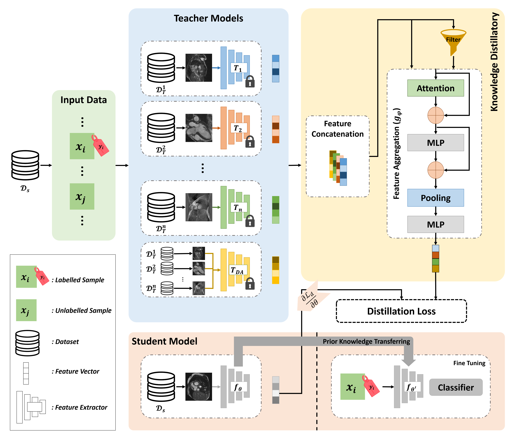

<div align="center">

<samp>

<h1> Multiple Teachers-Meticulous Student: A Domain Adaptive Meta-Knowledge Distillation Model for Medical Image Classification </h1>

[//]: # (<h4>  </h4>)

</samp>   

</div> 

[](https://arxiv.org/abs/2403.11226)


This repository contains the official implementation of the research paper titled "Multiple Teachers-Meticulous Student: A Domain Adaptive Meta-Knowledge Distillation Model for Medical Image Classification." The research focuses on developing a domain adaptive meta-knowledge distillation model tailored for medical image classification tasks. The model described in the paper leverages the knowledge from multiple teachers to train a meticulous student model capable of achieving high accuracy and generalization across different medical imaging domains.


<p align="center">
  
</p>


## Citation

If you find our code or paper useful, please cite as:

```bibtex
@article{nabavi2024multiple,
  title={Multiple Teachers-Meticulous Student: A Domain Adaptive Meta-Knowledge Distillation Model for Medical Image Classification},
  author={Nabavi, Shahabedin and Hamedani, Kian Anvari and Moghaddam, Mohsen Ebrahimi and Abin, Ahmad Ali and Frangi, Alejandro F},
  journal={arXiv preprint arXiv:2403.11226},
  year={2024}
  url={https://arxiv.org/abs/2403.11226}
}
```
